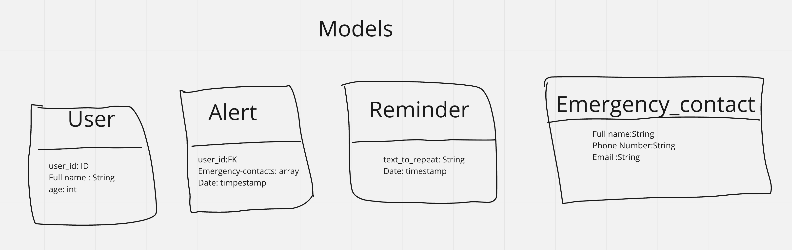

# Personal-Safety

Official repository for the GNG2101 Personal Safety app.

## Commands to run the repo

```

npm install --global expo-cli

```

* cd into the frontend folder and run the following command

```
npm install

```
* Now run the expo server with the following command 

```
expo start

```
You can see multiple option to run on a specific platform

No contribution has yet been made to the backend so no need to set it up


## To contribute please watch the following
**Front-end:**  

* https://www.youtube.com/watch?v=0-S5a0eXPoc&t=4221s
* Any javasctipt tutorail


**Back-end:**  


* https://www.youtube.com/watch?v=8wZ2ZD--VTk
* https://www.youtube.com/watch?v=QOtWb4Y-xxE
* https://www.youtube.com/watch?v=oyjzi837wME&t=1814s

					
				
 
 
  
